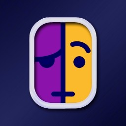

# <b>Linkalho</b>

Linkalho ist eine Homebrew-App, die NNID-Konten offline verknüpft. Sie verknüpft (oder trennt) <b>bestehende</b> Konten, sodass keine Spielstände verloren gehen.
Diese App erstellt keine neuen Konten. Wenn du ein neues Konto erstellst und es verknüpfen möchtest, führe die App einfach erneut aus.

 

## <b>Wozu brauche ich diese App?</b>
Wenn du nie Probleme beim Starten von Spielen/Apps hattest, bis du dein Switch-Benutzerkonto verknüpft hast, und wenn du nie Probleme mit Titeln hattest, die beim _Aktualisieren der Spieldaten_ hängen bleiben oder bestimmten offiziellen Emulatoren, die nur einen schwarzen Bildschirm anstelle der Spielauswahl zeigen, dann brauchst du diese Homebrew nicht.

 

Gefällt dir diese App und findest du sie nützlich? Du kannst mir einen Kaffee spendieren, indem du auf den Link unten klickst. Danke! 

 

## <b>Häufig gestellte Fragen</b>:
- Warum kann ich die App nicht per Touchscreen oder mit den Analog-Sticks bedienen?
  - Dies ist eine sehr einfache und unkomplizierte App, die die meisten Benutzer nur ein- oder zweimal verwenden werden. Solange die Borealis-Entwickler dies nicht nativ implementieren, gibt es keine Pläne meinerseits, deren Funktionsumfang zu erweitern.

- Kann ich mit einem gefälschten/generierten verknüpften Konto online gehen?
  - Nein! Du hast eine gehackte Switch. Online zu gehen ist immer ein Risiko.

- Kann diese App "beliebige Frage hier einsetzen"?
  - Lies zunächst den [vorherigen Abschnitt](https://github.com/rdmrocha/linkalho#why-do-i-need-this-app). Diese App ermöglicht es dir, eine gefälschte/generierte NNID mit deinen Benutzerkonten ohne Internetverbindung zu verknüpfen/trennen, das ist alles. Wenn du immer noch nicht verstehst, worum es geht und wozu es dient, brauchst du diese App wahrscheinlich einfach nicht. Keine Sorge: Wenn du sie jemals brauchst, wirst du es wissen.

 

## <b>Installation</b>:
- Platziere die .nro-Datei im Ordner `/switch/linkalho` deiner SD-Karte.
- Gehe zur Homebrew-App und starte Linkalho

 

### <u>Neustart zum Payload</u>
Nach Abschluss der ausgewählten Operation startet Linkalho zu einem vorhandenen Payload neu, wenn:
- die Konsolen-Hardware Erista ist und der Benutzer eine Payload-Datei im Anwendungsverzeichnis platziert (`/switch/linkalho/reboot.bin`)

Neustart zum Payload wird auf Mariko-Hardware nicht unterstützt!
 

## <b>Verwendung</b>:

### <u>Ausgewählte Konten verknüpfen</u>
- Verknüpft alle ausgewählten Konten von den auf der Konsole vorhandenen. Wenn eines der vorhandenen Konten bereits verknüpft ist, wird es neu verknüpft (unabhängig davon, ob die NNIDs offiziell verknüpft sind oder nicht).
Dieser Vorgang erstellt ein Backup in `/switch/linkalho/backups`

### <u>Ausgewählte Konten trennen</u>
- Entfernt die NNID-Verknüpfung von allen ausgewählten Konten auf der Konsole, unabhängig davon, ob die NNIDs offiziell verknüpft sind oder nicht.
Dieser Vorgang erstellt ein Backup in `/switch/linkalho/backups`

### <u>Backup wiederherstellen</u>
- Stellt einen vorherigen Zustand aus einer Backup-Datei wieder her. Die Datei muss sich in `/switch/linkalho/restore/restore.zip` befinden. Wenn nicht vorhanden, wird der Benutzer benachrichtigt.
Dieser Vorgang erstellt ein Backup in `/switch/linkalho/backups`

### <u>Manuelles Backup erstellen</u>
- Erstellt ein Backup in `/switch/linkalho/backups`.
Alle Verknüpfungs- und Trennungsvorgänge erstellen automatisch ein Backup, bevor Änderungen vorgenommen werden.
<b>Diese Option solltest du nur verwenden, wenn du manuell ein Backup erstellen möchtest!</b>

### <u>Land für verknüpfte Konten auswählen</u>
- Ermöglicht dem Benutzer, das Land anzupassen, das in das verknüpfte Konto eingefügt wird. Dies wirkt sich auf einige Software aus, indem die entsprechende Flagge angezeigt wird (wie in MK8).

### <u>Konten zum Verknüpfen/Trennen auswählen</u>
- Ermöglicht dem Benutzer auszuwählen, welche Konten verknüpft/getrennt werden sollen. Standardmäßig sind **_alle_** ausgewählt. Wenn keine Konten ausgewählt sind und der Benutzer versucht, einen Verknüpfungs- oder Trennungsvorgang durchzuführen, zeigt die Anwendung einen Fehler an.

 

## <b>Screenshots</b>

 

## <b>Danksagungen</b>
  - [devkitPro](https://devkitpro.org) für die Toolchain!
  - [natinusala (lib borealis)](https://github.com/natinusala/borealis) für die großartige Bibliothek, die die originale UI und UX der Switch nachahmt
  - [sebastiandev (zipper wrapper for minizip)](https://github.com/sebastiandev/zipper/) für ihren praktischen Wrapper für minizip
  - [Kronos2308](https://github.com/Kronos2308) für die Hilfe in den anfänglichen Forschungsphasen
  - [SciresM](https://github.com/SciresM) für seinen "Neustart zum Payload"-Code und [HamletDuFromage](https://github.com/HamletDuFromage) für die Code-Beiträge
  - **target** für das Icon, das Beta-Testing und die Bereitstellung wichtiger Dateien, die bei der Erstellung der Generatoren halfen
  - **boredomisacrime** für das Beta-Testing